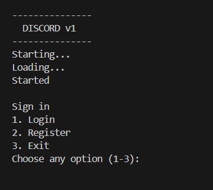
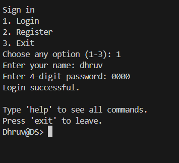
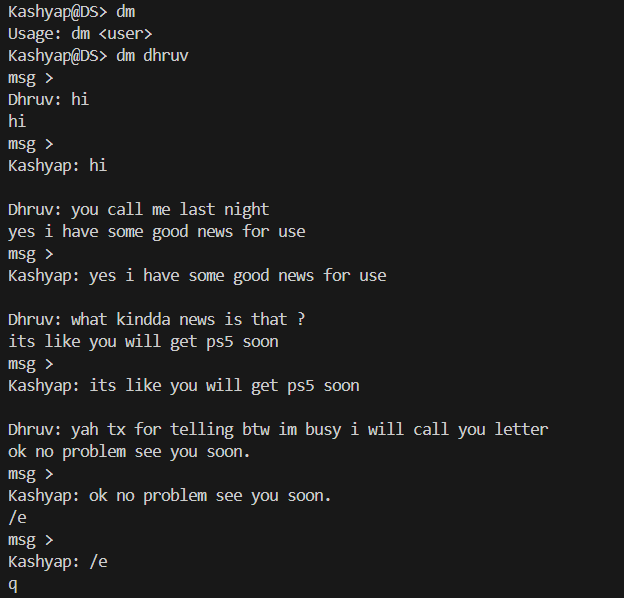
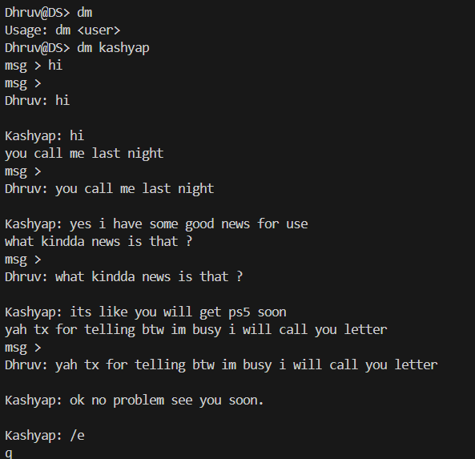
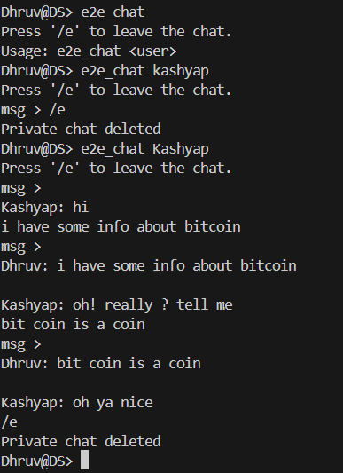
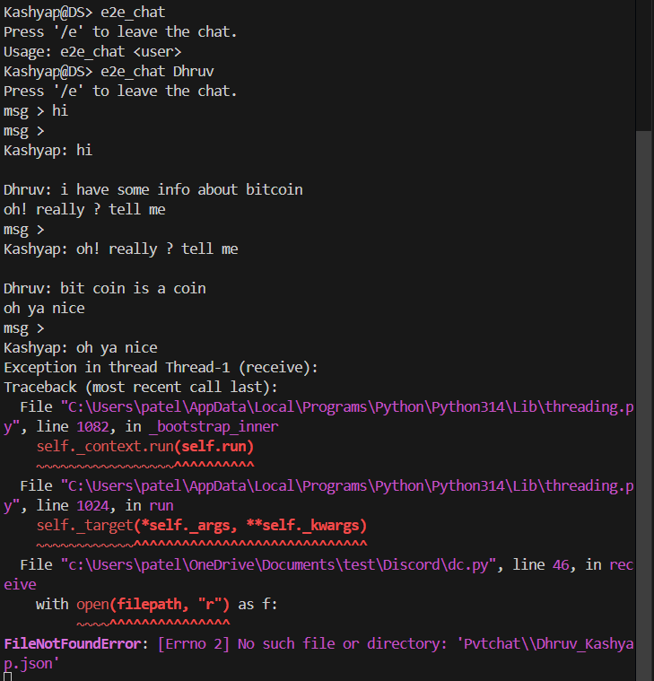
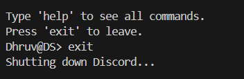
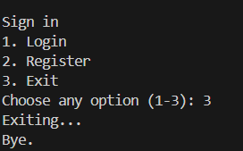

# CLI Discord (Python)

A terminal-based messaging application built with Python.
This project was created as a learning exercise to understand **JSON storage, file-based messaging, threading, and modular Python architecture**.

The application simulates basic Discord-like features such as authentication, direct messaging, and temporary encrypted chats inside a command-line interface.

---

## Features

* User authentication (login & register)
* Command-line interface (Linux-style commands)
* Direct Message (DM) system
* Temporary encrypted chat (E2E-style chat)
* JSON-based message storage
* Log system for events
* Real-time message updates using threading
* Modular project structure

---

## Screenshots

### Main Menu


### Login


### DM



### E2E



### End



## Technologies Used

* Python
* JSON (for data storage)
* Threading (for live chat updates)
* File system directories
* CLI interface

---

## Project Structure

```
Discord-Simulator/
│
├── authenticationdata/
│   └── userdata.json
│
├── Discord/
│    ├── authentication.py
│    ├── client.py
│    ├── cmds.py
│    ├── dc.py
│    ├── dcpannel.py
│    ├── logger.py
│    ├── main.py
│    └── server.py
│
├── DM/
│   └── (stored DM conversations).json
│
├── Logs/
│    └──logs.json
│
├── Pvtchat/
│    └──(temporary encrypted chats).json
│
├── screenshots/
│     └── Screenshots
│
├── .gitattributes
│
├── .gitignore
│
├── LICENSE
│
└── README.md
```

---

## How It Works

1. The program starts with a boot menu.
2. Users can **register or login**.
3. After login, the command panel opens.
4. Users can run commands to interact with the system.
5. Messages are stored in **JSON files** inside the DM directory.
6. Threads are used to check for new messages and display them in real time.

---

## Available Commands

```
help        Show all available commands
dm <user>   Start a direct message with a user
e2e_chat    Start a temporary encrypted chat
clear       Clear the terminal
exit        Close the application
```

---

## Example Usage

```
DS> dm Alex
Press '/e' to leave the chat.

msg > hello
msg > how are you
msg > /e
```

---

## Learning Goals

This project was built mainly to practice:

* Working with JSON files
* Python file handling
* Multi-file project structure
* Threading in Python
* CLI application design

## Author
Dhruv

Built as a learning project while exploring Python backend concepts.